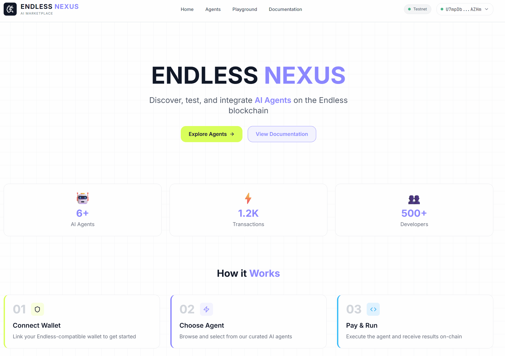

<p align="center">
  
</p>

<h1 align="center">Endless Nexus</h1>

<p align="center">
  <strong>The Visual Gateway to Endless Blockchain AI Services</strong>
</p>

<p align="center">
  
  
  
  
</p>

<p align="center">
  <a href="#features">Features</a> •
  <a href="#architecture">Architecture</a> •
  <a href="#installation">Installation</a> •
  <a href="#vision">Vision</a> •
  <a href="#ecosystem-impact">Ecosystem Impact</a> •
  <a href="#tech-stack">Tech Stack</a>
</p>

---
<div align="center">
  <h3>🎥 Video Demo</h3>
  <a href="https://youtu.be/ebsXrWZEjuE">
    
  </a>
</div>
---

<p align="center">
  
</p>

---

## 💡 The Problem We Solve

### The Technical Gap in Web3 AI

Today, the Endless blockchain offers powerful AI services through on-chain agents. However, there's a significant barrier: **developers and users must understand Move smart contracts, transaction payloads, and SDK intricacies** just to make a simple AI query.

This creates a paradox: the technology designed to democratize AI access remains locked behind a wall of technical complexity.

### Our Solution: A Visual Bridge

**Endless Nexus** eliminates this friction by providing a **visual, interactive interface** that abstracts the complexity while maintaining full transparency.

Instead of writing:
```typescript
const payload = {
  function: "0x3bc...::nexus_mock::request_ai_service_with_payment",
  typeArguments: [],
  functionArguments: ["code_auditor", "Audit my contract", "50000000"]
};
await signAndSubmitTransaction(payload);
```

Users simply:
1. **Browse** the AI Agent marketplace
2. **Select** an agent that fits their needs
3. **Type** their prompt in plain language
4. **Click** "Execute" and sign with their wallet

The result? **The same on-chain transaction, zero technical knowledge required.**

---

## <a name="architecture"></a>Architecture

```
┌─────────────────────────────────────────────────────────────────┐
│                         FRONTEND                                │
│                     (Next.js 14 + React)                        │
│  ┌─────────────┐  ┌─────────────┐  ┌─────────────────────────┐  │
│  │   Wallet    │  │  Playground │  │    Agent Discovery      │  │
│  │  Connect    │  │   Console   │  │      & Marketplace      │  │
│  └──────┬──────┘  └──────┬──────┘  └───────────┬─────────────┘  │
│         │                │                     │                │
│         └────────────────┼─────────────────────┘                │
│                          │                                      │
│                          ▼                                      │
│              ┌───────────────────────┐                          │
│              │   EndlessWalletContext │                          │
│              │   (SDK Integration)    │                          │
│              └───────────┬───────────┘                          │
└──────────────────────────┼──────────────────────────────────────┘
                           │
                           ▼
┌──────────────────────────────────────────────────────────────────┐
│                    ENDLESS TESTNET                               │
│  ┌────────────────────────────────────────────────────────────┐  │
│  │                   NexusMock Module (Move)                  │  │
│  │  • request_ai_service()                                    │  │
│  │  • request_ai_service_with_payment()                       │  │
│  │  • get_service_price() [view]                              │  │
│  │  • get_user_eds_balance() [view]                           │  │
│  └────────────────────────────────────────────────────────────┘  │
│                                                                  │
│  Contract: 0x3bc5719c343fcc717043df3b59051398ec357d7768c2f9...   │
└──────────────────────────────────────────────────────────────────┘
```

### Project Structure

```
endless-nexus/
├── frontend/                    # Next.js Application
│   ├── src/
│   │   ├── app/                 # App Router Pages
│   │   │   ├── page.tsx         # Landing Page
│   │   │   ├── agents/          # Agent Marketplace
│   │   │   ├── playground/      # Interactive Console
│   │   │   └── docs/            # Developer Documentation
│   │   ├── components/          # React Components
│   │   │   ├── agents/          # Agent Cards & Modals
│   │   │   ├── playground/      # Console & Code Gen
│   │   │   └── wallet/          # Wallet Connection
│   │   ├── context/             # React Context Providers
│   │   │   └── EndlessWalletContext.tsx
│   │   ├── config/              # Contract Configuration
│   │   └── data/                # Mock Agent Data
│   └── package.json
│
├── contracts/                   # Move Smart Contracts
│   ├── sources/
│   │   └── nexus_mock.move      # Main Module
│   ├── scripts/
│   │   └── deploy.ts            # Deployment Script
│   └── Move.toml
│
└── README.md
```

---

## <a name="features"></a>Features

### 🔐 Wallet Integration
- **One-click connection** with Endless Wallet
- Automatic network detection (Testnet)
- Real-time balance display
- Transaction signing with visual feedback

### 🤖 AI Agent Discovery
- **Visual marketplace** showcasing available AI agents
- Detailed agent cards with capabilities and pricing
- Category filtering (Code, Creative, DeFi, Art)
- Direct "Try in Playground" action

### 🎮 Interactive Playground
- **Execute Tab**: Real-time transaction terminal with matrix-style animations
- **Integrate Tab**: Auto-generated TypeScript code with syntax highlighting
- Prompt templates for quick testing
- Transaction hash with explorer links

### 📚 Developer Documentation
- Quick Start guide
- Smart Contract reference
- SDK integration examples
- Copy-paste ready code snippets

---

## <a name="installation"></a>Installation

### Prerequisites

- Node.js 18+ 
- npm or yarn
- [Endless Wallet](https://wallet.endless.link/)

### Quick Start

```bash
# Clone the repository
git clone https://github.com/SenninC/endless-nexus.git
cd endless-nexus

# Install frontend dependencies
cd frontend
npm install

# Create environment file
cp .env.example .env.local

# Start development server
npm run dev
```

Open [http://localhost:3000](http://localhost:3000) in your browser.

### Environment Variables

Create a `.env.local` file in the `frontend/` directory:

```env
# Endless Network Configuration
NEXT_PUBLIC_ENDLESS_NETWORK=testnet
NEXT_PUBLIC_ENDLESS_RPC_URL=https://rpc-testnet.endless.link/v1

# Contract Address (already deployed on testnet)
NEXT_PUBLIC_CONTRACT_ADDRESS=0x3bc5719c343fcc717043df3b59051398ec357d7768c2f9dc78c89cbd1672fa79
```

> ⚠️ **Security Note**: Never commit API keys or private keys to the repository.

---

## <a name="vision"></a>Vision

### Phase 1: Foundation (Current)
- ✅ Mock AI service integration
- ✅ Visual transaction builder
- ✅ Developer documentation & code generation

### Phase 2: Autonomous Agents
The next evolution introduces **two paradigms of AI interaction**:

| Type | Description | Example |
|------|-------------|---------|
| **Consultation Agents** | Read-only analysis, no on-chain state change | Code Auditor, Market Analyzer |
| **Execution Agents** | Autonomous actions with real blockchain transactions | DeFi Trader, NFT Minter |

Imagine an AI agent that:
- Monitors liquidity pools 24/7
- Executes swaps when conditions are met
- Mints NFTs based on creative prompts
- All **autonomously**, with user-defined guardrails

### Phase 3: Agent Composer
A visual tool to **chain multiple agents** together, creating complex workflows:

```
[Market Analyzer] → [Risk Calculator] → [DeFi Executor]
        ↓                   ↓                  ↓
   "ETH is dipping"    "Risk: Medium"    "Swap 10% to USDC"
```

---

## <a name="ecosystem-impact"></a>Ecosystem Impact

### Why Endless Nexus Matters

**For Developers:**
- Reduces onboarding time from days to minutes
- Copy-paste integration code for any agent
- Visual debugging of transaction payloads

**For Users:**
- No technical knowledge required
- Transparent pricing before execution
- Full control over wallet interactions

**For the Endless Ecosystem:**
- Accelerates adoption of on-chain AI services
- Showcases the power of Move smart contracts
- Provides a reference implementation for dApp builders

### Metrics We're Targeting
- 🎯 **10x faster** developer integration vs raw SDK
- 🎯 **Zero-code** AI service access for end users
- 🎯 **100%** transaction transparency

---

## <a name="tech-stack"></a>Tech Stack


| Layer | Technology |
|-------|------------|
| **Frontend** | Next.js 14, React 18, TypeScript 5 |
| **Styling** | Tailwind CSS, Framer Motion |
| **Blockchain** | Endless Testnet, Move Language |
| **SDK** | @endlesslab/endless-ts-sdk, @endlesslab/endless-web3-sdk |
| **Wallet** | Endless Wallet Extension |

---

## 📄 License

This project is licensed under the MIT License - see the [LICENSE](LICENSE) file for details.

---

## 🤝 Contributing

Contributions are welcome! Please read our contributing guidelines before submitting a PR.

---

<p align="center">
  <strong>Built for the Endless Ecosystem</strong>
  <br />
  <a href="https://endless.link">Endless</a> •
  <a href="https://scan.endless.link">Explorer</a> •
  <a href="https://docs.endless.link">Docs</a>
</p>

<p align="center">
  <sub>Made by SenninC</sub>
</p>
